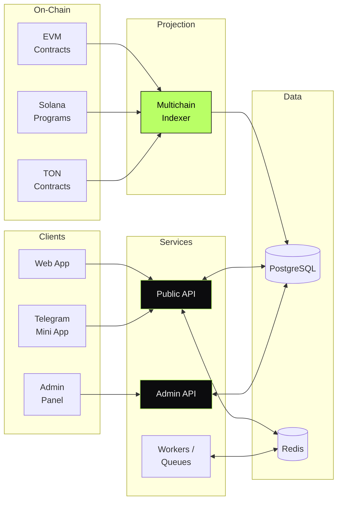

<div align="center">

```
  ██╗    ██╗███████╗██╗    ██╗ █████╗ ██╗   ██╗
  ██║    ██║██╔════╝██║    ██║██╔══██╗╚██╗ ██╔╝
  ██║ █╗ ██║█████╗  ██║ █╗ ██║███████║ ╚████╔╝
  ██║███╗██║██╔══╝  ██║███╗██║██╔══██║  ╚██╔╝
  ╚███╔███╔╝███████╗╚███╔███╔╝██║  ██║   ██║
   ╚══╝╚══╝ ╚══════╝ ╚══╝╚══╝ ╚═╝  ╚═╝   ╚═╝
```

# WeWay — Multichain Launchpad Ecosystem

#### Production token-sale platform across **EVM, Solana, and TON.**
#### Designed end-to-end — contracts, indexer, services, admin, and Telegram-native UX.

[](#)
[](#)
[](#)
[](#)

</div>

---

> **TL;DR** — A multichain launchpad I designed and led from a blank repo to production:
> ten cooperating services, three chain backends, a custom indexer, a Telegram
> mini-app, and an ops console. Battle-tested on real launches.

---

## Overview

WeWay is a full-stack launchpad ecosystem: project teams configure token sales,
vesting schedules, and claim flows on **EVM, Solana, and TON**; participants
interact through both a Web app and a **Telegram mini-app**; the ops team
runs everything from a purpose-built admin console.

The system spans **ten cooperating services** across smart contracts,
indexers, queue workers, public/admin APIs, and three user-facing surfaces.
I designed and led each layer between 2023 and 2025.

> This repository documents the system at the **architectural level**.
> Implementation code is private — what follows is the design.

---

## My Role

> **Lead Architect & Tech Lead.**
> Architectural ownership, technical direction, and final call on every
> system-level decision.

I owned the system end-to-end:

- **Architecture** — service decomposition, chain abstraction, data model
- **Smart-contract integration** — settlement semantics across EVM / Solana / TON
- **Backend** — NestJS service mesh, PostgreSQL schemas, Redis queues, BullMQ workers
- **Indexer design** — on-chain projection, reorg handling, idempotent state
- **Telegram mini-app** — auth, signing flow, UX inside the Telegram WebApp runtime
- **Admin tooling** — project lifecycle, KYC review, manual overrides, audit log
- **Production** — deployment topology, observability, on-call rotation

---

## Architecture



---

## System Components

| Component | Responsibility | Stack |
|---|---|---|
| **Public API** | Sale data, user state, claim, vesting reads | NestJS · PostgreSQL · Redis |
| **Admin API** | Project onboarding, sale config, KYC, ops actions | NestJS · PostgreSQL · audited mutations |
| **Workers** | Background jobs, KYC sync, notifications, on-chain hooks | NestJS · BullMQ · Redis |
| **Multichain Indexer** | On-chain → relational projection across three chains | Node.js · Ethers · @solana/web3.js · TON SDK |
| **Web App** | Public sale UI, wallet flow, claim | Next.js · wagmi · @solana/wallet-adapter |
| **Telegram Mini App** | Native sale UX inside Telegram | Next.js · Telegram WebApp SDK |
| **Admin Panel** | Ops dashboard, project lifecycle, support tooling | Next.js · TypeScript |
| **Landing v3** | Marketing surface, brand site | Next.js · Tailwind · Framer Motion |

---

## Capabilities

- **Multichain sale orchestration** — one sale config drives EVM, Solana, and TON
- **Programmable vesting & claim** — cliff, linear, milestone-based schedules
- **KYC integration layer** — provider-agnostic adapter pattern
- **Telegram-native UX** — full sale flow without leaving the chat client
- **Ops console** — project teams onboarded, configured, audited without engineering
- **Indexer-driven analytics** — funnel, raise, claim metrics in real time
- **Self-hosted observability** — Grafana + Loki + Prometheus

---

## Architectural Decisions & Tradeoffs

A few of the load-bearing decisions I made — and why.

### 1. Chain-agnostic sale engine, chain-specific adapters

The sale-engine domain logic (eligibility, allocation, vesting, claim) is
written **once** and is chain-agnostic. Per-chain adapters translate intents
into the appropriate settlement semantics. Result: adding a new chain is a
**bounded adapter problem**, not a system rewrite.

### 2. Reorg-safe projection in the indexer

The indexer treats blocks as **provisional until finalized**. State is rolled
back on reorgs without app downtime. Anything user-visible blocks on
finality, anything operational reads provisional state.

### 3. Queue-backed mutations only

Every state-mutating action goes through a **durable job queue**. This buys
retries, audit, back-pressure, and replayability — at the cost of more
moving parts. For a system with on-chain side effects, this is the right
tradeoff.

### 4. Admin actions are signed, audited, and replayable

Every admin mutation produces an **append-only audit record** and a
re-executable payload. Required for compliance reviews and forensic recovery
of operator mistakes.

### 5. Idempotent claim pipeline

Designed for at-least-once chain confirmation without double-spend. Claim
records carry a server-side nonce and a chain-state assertion; reconciliation
is a pure function of (server state, chain state).

---

## Engineering Invariants

The non-obvious things I designed the system to **never** do:

- **Never** rely on chain ordering for business correctness — only finality
- **Never** mutate user state outside a durable job
- **Never** trust admin actions without audit + signature
- **Never** couple chain-specific quirks into shared domain code
- **Never** write the same "what does this sale look like" query in two places

---

## Related Public Documents

These showcase repos cover adjacent surfaces in more depth:

- [`market-making-infra`](https://github.com/eldardzh/market-making-infra) — MM operations layer used alongside launches
- [`multichain-contracts`](https://github.com/eldardzh/multichain-contracts) — contract patterns across EVM / Solana / Sui / TON
- [`solana-pumpfun-backend`](https://github.com/eldardzh/solana-pumpfun-backend) — high-throughput Solana backend patterns
- [`grafana-observability-stack`](https://github.com/eldardzh/grafana-observability-stack) — self-hosted metrics + logs

---

<div align="center">

#### **Contact**

[**eldardzh.com**](https://eldardzh.com) · [**@EldarDissmay**](https://x.com/EldarDissmay) · **dissmay21@gmail.com**

<sub>© 2026 · Eldar D. · Built 2023 — 2025.</sub>

</div>
